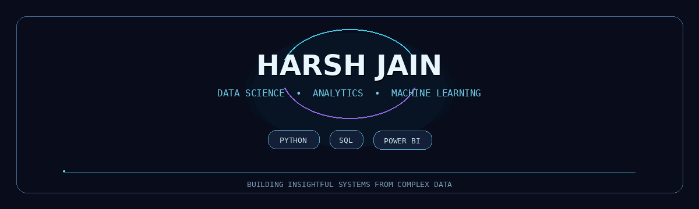

# Hi, I'm Harsh Jain

### Data Scientist • Data Analyst • Machine Learning Enthusiast

I transform data into **actionable insights, predictive models, and business-ready dashboards** using Python, SQL, machine learning, and Power BI.

---

## About Me

- Data Science Intern at **Deets Digital**, working on demand forecasting and inventory analytics.
- Former Front-End Developer at **Potenz Technology**.
- Pursuing an **MCA at G.L.S. University, Ahmedabad**; BCA graduate from Gujarat University.
- Ranked **1st in the batch** in a Data Science certification program at Fly the Nest, Ahmedabad.
- Interested in predictive modeling, exploratory data analysis, statistical analysis, ETL, SQL analytics, and executive dashboards.

## What I Work With

### Data Science and Machine Learning

### Analytics, Databases and BI

### Web Development and Tools

---

## Project Portfolio

### Machine Learning and Predictive Analytics

| Project | What it demonstrates |
|---|---|
| [Rainfall Prediction ML Pipeline](https://github.com/HARSHjain170/Rainfall_Project) | Six-model classification comparison, GridSearchCV, cross-validation, and model serialization. |
| [Bank Loan Approval Prediction](https://github.com/HARSHjain170/Bank-loan-Approval-prediction-) | Credit-risk classification, imbalanced data handling, evaluation metrics, and applicant analytics. |
| [Stock Price Prediction](https://github.com/HARSHjain170/Stock-Price-Prediction) | Moving averages, technical indicators, and time-series trend analysis. |
| [Python Data Science Projects](https://github.com/HARSHjain170/Pythons-Projects-) | End-to-end Jupyter Notebook projects covering HR attrition, Titanic, Netflix, wine, and other datasets. |

### Data Analytics and Business Intelligence

| Project | What it demonstrates |
|---|---|
| [Hospital ER Patient Analytics](https://github.com/HARSHjain170/Hospital-ER-Patient-) | Patient analytics, wait-time trends, SQL window functions, EDA, and Power BI KPIs. |
| [Customer Behaviour and RFM Analysis](https://github.com/HARSHjain170/Cutomer_behaviour_analysis) | Customer segmentation, purchase frequency, lifetime value, churn indicators, and dashboarding. |
| [User Conversion Funnel Analytics](https://github.com/HARSHjain170/Funnel-) | Multi-stage user journeys, conversion drop-offs, retention, and product analytics. |
| [Power BI Projects](https://github.com/HARSHjain170/Power-BI-Projects) | Executive KPI dashboards, DAX measures, star-schema modeling, and business intelligence. |
| [SQL Projects](https://github.com/HARSHjain170/SQL-Projects) | Twelve SQL problem domains using joins, CTEs, window functions, aggregations, and query optimization. |

### Web Development and UI

| Project | What it demonstrates |
|---|---|
| [School Management System](https://github.com/HARSHjain170/School-Management-System) | PHP-based school platform with Admin, Faculty, and Student roles and multi-role authentication. |
| [Figma UI Implementations](https://github.com/HARSHjain170/figma) | Responsive HTML/CSS components and Figma-to-code interface implementations. |

---

## GitHub Activity

### 3D Contribution Galaxy

## Education and Certifications

- **Master of Computer Applications (MCA)** — G.L.S. University, Ahmedabad *(2025–Present)*
- **Bachelor of Computer Applications (BCA)** — Gujarat University *(2021–2024)*
- **Data Science Certification** — Fly the Nest, Ahmedabad; ranked 1st in the batch
- **SQL for Data Science Certification** — Simplilearn

## Let's Connect

I am open to collaboration and opportunities in **Data Science, Data Analytics, Machine Learning, SQL, and Business Intelligence**.

- Email: [harshjain17074@gmail.com](mailto:harshjain17074@gmail.com)
- GitHub: [github.com/HARSHjain170](https://github.com/HARSHjain170)

---

*Thanks for visiting my profile. Explore the repositories above to see my work in action.*

